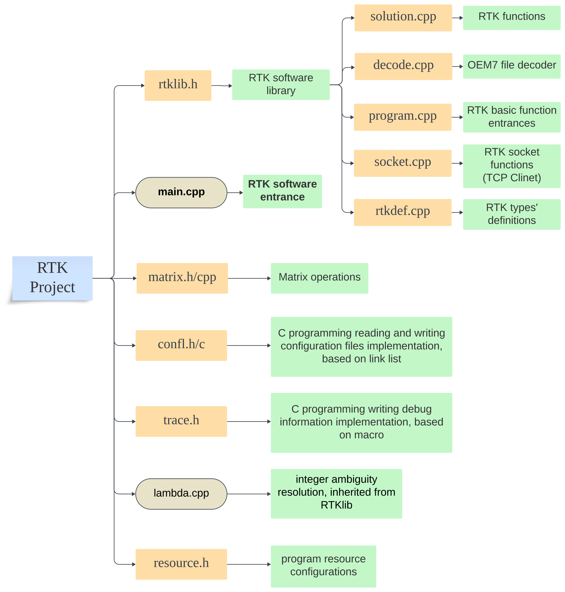
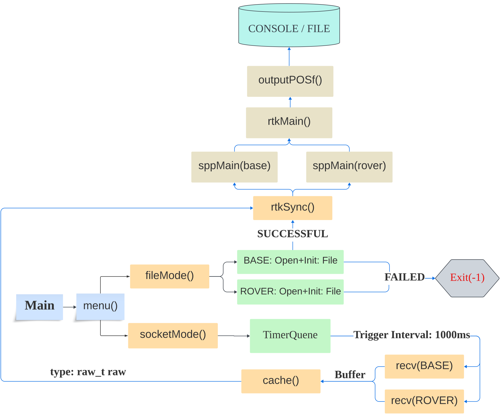

# RTK

RTK软件支持GPS: L1,L2与BDS: B1I, B3I双频双系统，支持NovAtel OEM7格式的原始二进制文件。

## 1 RTK项目配置参数

项目的配置文件为./config目录下的rtkcfg.config;
通过配置文件提供不同解算参数选择：
①单双频/双频RTK、②实时/事后RTK、③静态/动态RTK、④最小二乘/扩展卡尔曼滤波、⑤输出调试信息：是/否、⑥自定义原始文件/结果输出路径、⑦解算结果对接rtkplot标准格式、⑧TCP Client数据的本地同步存储、⑨过程/量测噪声、ratio阈值、卫星截止高度角的自定义调整等。

## 2 程序编译与运行

### 2.1 源码及编译

项目采用VS 2017管理, ./src目录下提供了所有源码。

如果你想在项目外尝试单独执行RTK.exe程序，那么需要考虑一下修改配置文件的读取位置并且重新编译该项目，若如此做，建议在rtklib.h文件中修改PATH_CFGDIR与PATH_LOGDIR，确保配置文件能够被合适地读取、结果文件能够找到(比如，..\修改为.\即可)。

### 2.2 依赖库

除了基本的C++标准库之外, RTK项目无任何其他依赖库。

### 2.3 运行结果

RTK定位结果(*.pos/*.cmp files)、中间结果(*.log files)、debug跟踪(*.trace files)等文件等均保存至./log文件夹下。
如果并非二次开发，建议不要在配置文件中设置打开输出debug信息，这样做会由于频繁IO明显地降低执行效率; 或者如果你愿意，可以在trace.h中选择关闭编译log/trace相关模块的代码并且重新编译此项目，这样做会使生成的exe文件体积更小。

### 2.4 可视化

./log文件夹下的'*.cmp'文件(意为compressed的pos结果文件)对接rtklib标准，可以直接使用rtkplot.exe导入该文件进行RTK结果可视化。

## 3 数据集

### 3.1 测试数据

./dataset目录下存放你的NovAtel OEM7原始二进制文件，注意区分基站和流动站的数据。

### 3.2 RTK自采集数据

如果以实时RTK模式解算，程序默认设置从TCP Client采集基站、流动站播发的原始二进制数据，并命名为"*.oem719"保存至./log目录下

## 4 模块继承
提供了独立可继承的模块：confl.h/c（基于单向链表的配置文件读写）、matrix.h/cpp（丰富的矩阵运算）、trace.h（调试与日志）可分别作为单独模块为相关开发提供参考。
